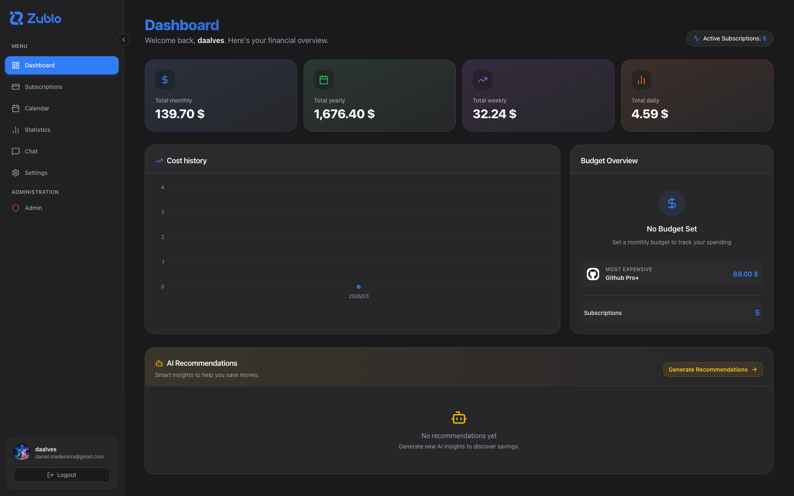
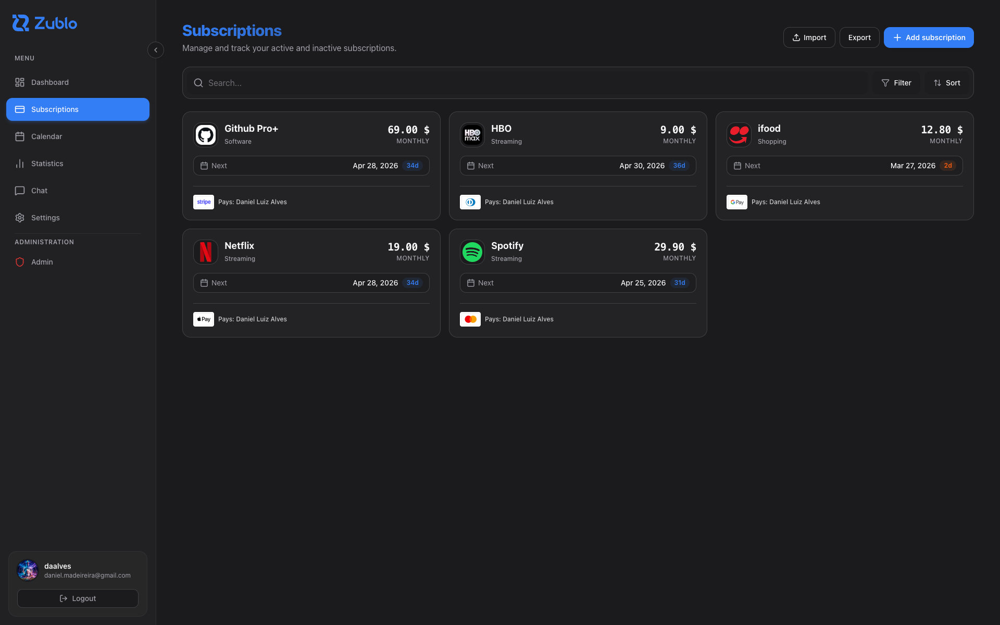
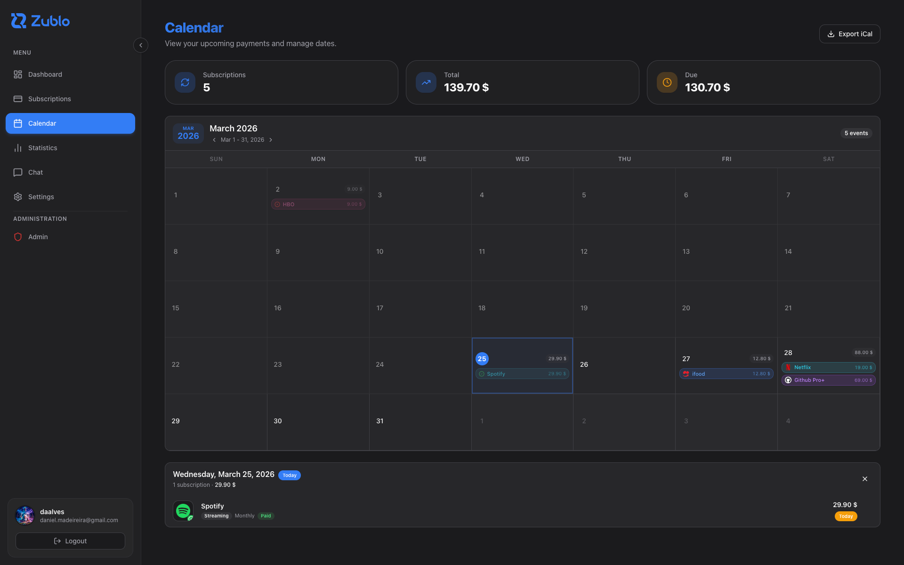
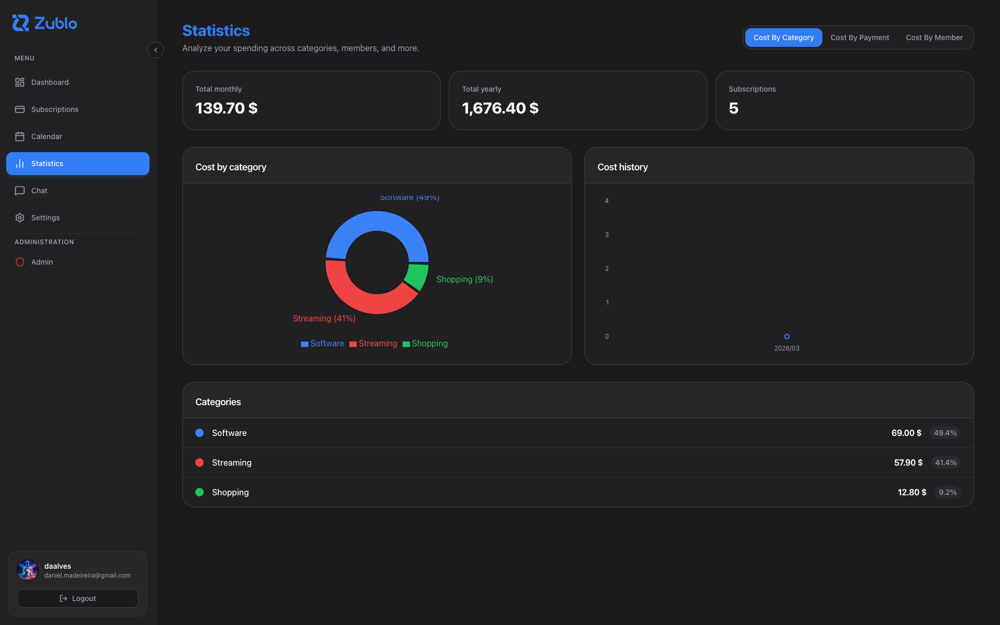
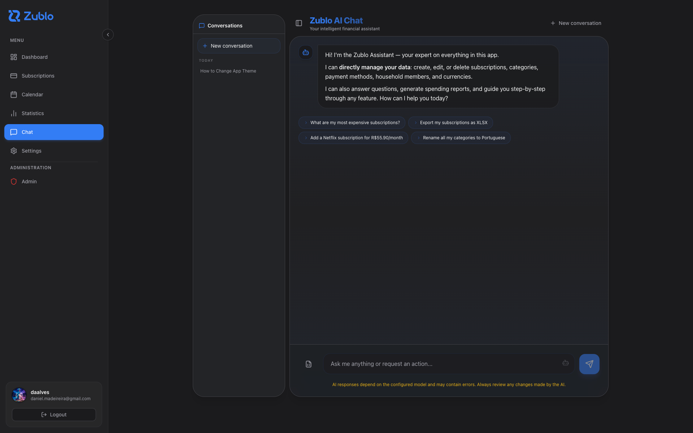

<p align="center">
  
</p>

<p align="center">
  <strong>Self-hosted subscription tracking with AI that is actually useful.</strong>
</p>

<p align="center">
  Open source. Docker-first. Built for self-hosters, homelabs, and people who want control over recurring payments.
</p>

<p align="center">
  <a href="#deploy-in-minutes"><strong>Deploy in minutes</strong></a>
  ·
  <a href="#demo"><strong>See the demo section</strong></a>
  ·
  <a href="./ARCHITECTURE.md"><strong>Read the architecture</strong></a>
</p>

<p align="center">
  <a href="./LICENSE"></a>
  <a href="https://github.com/danielalves96/zublo/stargazers"></a>
  <a href="https://github.com/danielalves96/zublo/issues"></a>
  <a href="#deploy-in-minutes"></a>
  <a href="https://pocketbase.io/"></a>
  <a href="#ai-built-in"></a>
  <a href="#perfect-for"></a>
</p>

Zublo is an open source subscription tracker for people who want every recurring payment in one place, full control over their data, and a deployment flow that takes minutes instead of a weekend.

It gives you a clean web UI, recurring payment visibility, reminders, calendar and statistics views, API access, and a Docker-first setup built for self-hosters.

It also has one of the most differentiated parts of the product built in: an AI layer that can analyze spending, power chat-based workflows, and connect to multiple LLM providers instead of locking you into a single vendor.

If you want a focused alternative to bloated finance software or closed SaaS trackers, this is the repo.

## Why This Repo Gets Attention

- It solves a real problem with a narrow, practical scope
- It is self-hosted, so your data stays under your control
- It is easy to deploy and easy to understand
- It uses a compact stack instead of a pile of infrastructure
- It is useful on day one, even if you never touch the code

## At A Glance

| What matters | Why it lands |
|---|---|
| One job, done well | Track recurring payments without turning into a full finance suite |
| Fast deployment | A simple Docker setup gets the app running quickly |
| Real ownership | Your data lives on your infrastructure |
| AI that is actually useful | Chat, recommendations, and provider flexibility are part of the product |
| Compact architecture | React frontend, PocketBase runtime, no unnecessary platform sprawl |
| Forkable codebase | Small enough to understand, practical enough to extend |

## Perfect For

| Use case | Why Zublo fits |
|---|---|
| Self-hosters | One container, SQLite persistence, no heavy platform requirements |
| Homelab users | Small footprint, easy backup story, easy reverse proxy integration |
| Privacy-minded users | Your subscription data stays on your own infrastructure |
| Indie builders | Compact full-stack codebase that is practical to fork and extend |
| Teams tracking shared spend | Clear recurring cost visibility without adopting a full finance suite |

## Demo

Demo screenshots


<p align="center">
  
</p>

<p align="center">
  
  
  
  
</p>


## Feature Overview

| Area | What you get |
|---|---|
| Subscriptions | Recurring billing cycles, due dates, payment context |
| Calendar | Upcoming payments in a calendar view |
| Dashboard | High-level cost visibility and summary metrics |
| Statistics | Spending breakdowns and trend visibility |
| Currencies | Multi-currency handling with exchange-rate sync |
| API access | REST usage through scoped API keys |
| AI | Chat-based workflows, recommendations, and pluggable providers |
| Authentication | TOTP-based 2FA |
| Deployment | Single self-hosted app with Docker |

## AI Built In

This is not a cosmetic AI checkbox.

Zublo includes an AI layer that can work with your subscription data and support real product workflows:

- AI-powered recommendations from your spending data
- chat interface wired into app capabilities
- support for multiple provider setups instead of a single locked vendor
- compatibility with local or self-hosted inference paths

Supported provider model includes:

- Google Gemini
- OpenAI
- Ollama
- OpenAI-compatible endpoints such as OpenRouter, Groq, Mistral, and similar gateways

That makes Zublo interesting not only as a self-hosted subscription tracker, but also as a practical example of an AI-enabled product that still keeps deployment and ownership simple.

## Why It Feels Good To Self-Host

| Characteristic | What that means in practice |
|---|---|
| Single app runtime | Frontend and backend ship together |
| SQLite persistence | Simple backups and low operational overhead |
| PocketBase core | Auth, data, and admin capabilities without a large backend stack |
| Docker-first packaging | Easy to run on VPS, NAS, mini-PC, or homelab |
| Narrow product scope | Less maintenance drag than a general finance platform |

## What Zublo Is Not

- not a full accounting suite
- not a bookkeeping platform
- not a bank sync product
- not a cloud-only SaaS

That narrow scope is the point.

## Stack

| Layer | Technology |
|---|---|
| Frontend | React 18, Vite, TypeScript, TanStack Router, React Query, Tailwind CSS |
| Backend runtime | PocketBase |
| Backend customization | PocketBase JS hooks and migrations |
| Persistence | SQLite via PocketBase |
| Packaging | Docker, Docker Compose, GHCR |

## Deploy In Minutes

Create a `docker-compose.yml` like this:

```yaml
services:
  zublo:
    image: ghcr.io/danielalves96/zublo:latest
    container_name: zublo
    restart: unless-stopped
    ports:
      - "9597:9597"
    environment:
      PB_ENCRYPTION_KEY: "change-me-in-production"
    volumes:
      - ./zublo-data:/pb/pb_data
```

Start it:

```bash
docker compose up -d
```


Then open:

- `http://localhost:9597` for the app
- `http://localhost:9597/_/` for PocketBase admin
- `http://localhost:9597/api/` for the REST API

Important:

- persist `/pb/pb_data`
- set `PB_ENCRYPTION_KEY` in real deployments
- the first registered user becomes the initial admin

## Local Development

If you want to work on the repo itself:

```bash
bun install
bun run dev
```

This starts:

- Vite on `http://localhost:5173`
- PocketBase on `http://127.0.0.1:8080`

For non-Docker local development, the repository expects a PocketBase binary at `apps/backend/pocketbase`.

## Architecture At A Glance

Zublo is intentionally compact.

- `apps/web` contains the React application
- `apps/backend` contains PocketBase hooks, migrations, runtime assets, and backend behavior
- the frontend is built into `apps/backend/pb_public` for production serving
- PocketBase serves both the API and the built frontend in production
- mutable runtime data lives in `/pb/pb_data`

In local development:

- Vite serves the frontend
- PocketBase serves the API
- Vite proxies `/api` to PocketBase

In production:

- one container serves the frontend and backend together

For the full repository-level architecture, see [ARCHITECTURE.md](./ARCHITECTURE.md).
For frontend-specific structure and page composition rules, see [apps/web/ARCHITECTURE.md](./apps/web/ARCHITECTURE.md).

## Repository Layout

```text
.
├── apps/
│   ├── backend/   # PocketBase hooks, migrations, runtime assets
│   └── web/       # React application
├── scripts/       # Maintainer utilities
├── Dockerfile
├── docker-compose.yml
├── Makefile
└── README.md
```

## Who This Repository Is For

- self-hosters
- homelab users
- contributors who want a small, understandable full-stack app
- developers interested in PocketBase-backed products

## Why The Codebase Stays Approachable

- React frontend and PocketBase backend live in the same repo
- custom backend logic is grouped by domain in hook files
- the production runtime is compact and easy to reason about
- the deployment model is simple enough for solo operators
- the product scope is intentionally constrained

## Contributing

Zublo is still shaping its public open source surface. Good contributions right now are the ones that improve clarity, onboarding, maintainability, and narrowly scoped behavior.

Start here:

- [CONTRIBUTING.md](./CONTRIBUTING.md)
- [SUPPORT.md](./SUPPORT.md)
- [SECURITY.md](./SECURITY.md)
- [CODE_OF_CONDUCT.md](./CODE_OF_CONDUCT.md)

## Maintainer

Zublo is maintained by Daniel Luiz Alves.

GitHub: `@danielalves96`

## License

Zublo is licensed under Apache License 2.0.

Copyright Daniel Luiz Alves.

See [LICENSE](./LICENSE) and [NOTICE](./NOTICE).
